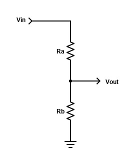

Voltage Divider
============================

Theory and background
---------------------

In electronics, resistive voltage dividers are used for a variety of purposes.
The formula for a resistive voltage divider is:

:math:`\frac{V_{out}}{V_{in}} = \frac{R_b}{(R_a + R_b)}` [1]_

When designing voltage dividers, constraints may demand engineers choose
resistors from a set of “preferred values” [2]_. These values are
discrete and engineers must select the best combination of resistors
based on tolerance and the available preferred values.  Similar voltage
ratios can be obtained with different combinations of resistor values.

The voltage divider nomograph links input voltage, output voltage and a
pair of resistor values into a single nomograph.  Pynomo’s “Type 5” blocks
are well suited for plotting relationships between pairs of discrete values.
A vertical line dropped from the intersection of Ra values and Rb values3
reveals the Vout / Vin voltage ratio.  Alignment with a Type 2 block allows
the engineer to determine the output voltgage given an input voltage (or vice versa).

Of greater benefit is the ability to quickly determine the optimum pair
of resistor values for a given application.  For example, given an input
voltage (9V) and desired output voltage (3.3V), the engineer draws a straight
line from the Vout axis, through the Vin axis to the base of the voltage ratio
graph.  A perpendicular line is then drawn from the base to the top of the
graph.  The vertical line’s nearest approach to the intersection of :math:`R_a` and
:math:`R_b` values represents the best combination of resistor values.  It can be
quickly shown that one combination of values (:math:`R_a` = 6.2 and :math:`R_b` = 3.6) will
produce an output voltage very close to the desired value (3.3061V).

Generated nomograph
-------------------

.. image:: ex_voltage_divider.*

Source code
-----------

.. literalinclude:: ex_voltage_divider.py
    :encoding: latin-1
    :linenos:
    :lines: 1-4, 20-

.. [1]
   https://en.wikipedia.org/wiki/Voltage_divider

.. [2]
   https://eepower.com/resistor-guide/resistor-standards-and-codes/resistor-values
